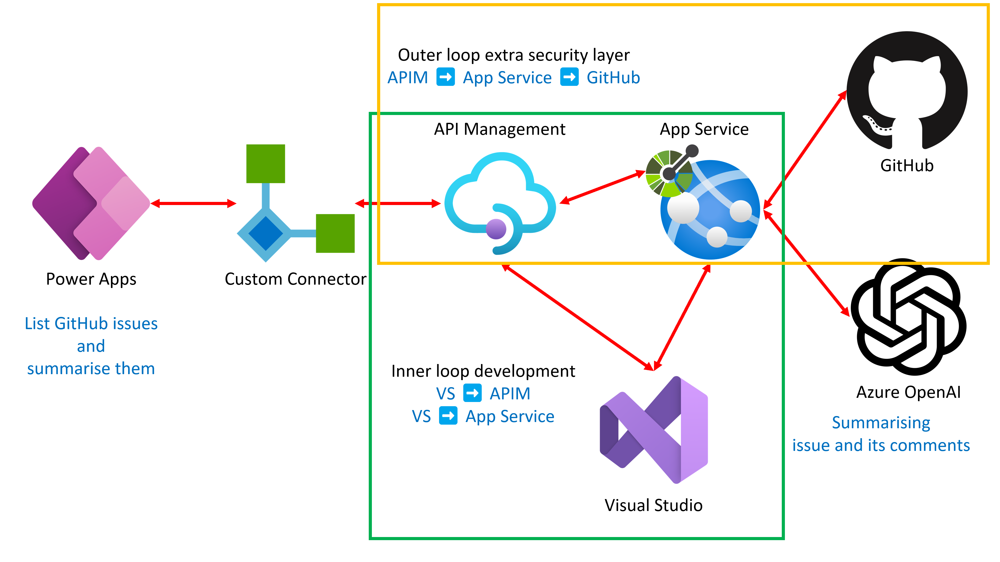

# ASP.NET Web API for Power Platform Custom Connector (feat. Azure OpenAI Service)

This is a sample application that lists up GitHub issues on a specific repository and summarize them. Through this sample application, it shows:

1. How easy to integrate ASP.NET Core Web API with Azure API Management within Visual Studio
1. How easy to set up an authorization feature directly on Azure API Management
1. How easy to export a Power Platform Custom Connector directly from Azure API Management

## Goal

- You can call Azure OpenAI Service API through ASP.NET Core Web API.
- You can call GitHub API through ASP.NET Core Web API.
- You can build and deploy an ASP.NET Core Web API to Azure App Service within Visual Studio.
- You can integrate the Azure App Service instance with Azure API Management within Visual Studio.
- You can automatically generate a GitHub access token through Azure API Management.
- You can create a Power Platform Custom Connector directly from Azure API Management.

## Application Architecture



## Prerequisites

- [GitHub Account](https://github.com/signup)
- [Azure Free Account](https://azure.microsoft.com/free?WT.mc_id=dotnet-94866-juyoo)
- [Azure OpenAI Service](https://learn.microsoft.com/azure/cognitive-services/openai/overview?WT.mc_id=dotnet-94866-juyoo)
- [Visual Studio](https://visualstudio.microsoft.com/vs/?WT.mc_id=dotnet-94866-juyoo)
- [GitHub CLI](https://cli.github.com)
- [Azure CLI](https://learn.microsoft.com/cli/azure/what-is-azure-cli?WT.mc_id=dotnet-94866-juyoo)
- [Azure Developer CLI](https://learn.microsoft.com/azure/developer/azure-developer-cli/overview?WT.mc_id=dotnet-94866-juyoo)

## Getting Started

1. Fork this repository to your GitHub account. `{{GITHUB_USERNAME}}` is your GitHub username.
1. Follow the steps in the following order. `{{GITHUB_USERNAME_FOR_ISSUES}}` and `{{GITHUB_REPOSITORY_NAME_FOR_ISSUES}}` values are the GitHub username and repository name to see the issues.

    ```bash
    # Provision resources on Azure
    azd auth login
    azd init
    azd env set GITHUB_USERNAME {{GITHUB_USERNAME_FOR_ISSUES}}
    azd env set GITHUB_REPOSITORY {{GITHUB_REPOSITORY_NAME_FOR_ISSUES}}
    azd up
    azd config pipeline
    
    # Deploy app to Azure
    gh auth login
    gh workflow run "Azure Dev" --repo {{GITHUB_USERNAME}}/aspnet-web-api-for-power-platform-custom-connector
    ```

## Resources

- [ChatGPT Getting Started &ndash; Azure OpenAI](https://learn.microsoft.com/azure/cognitive-services/openai/chatgpt-quickstart?WT.mc_id=dotnet-94866-juyoo&pivots=programming-language-csharp&tabs=command-line)
- [Authorization &ndash; Azure API Management](https://learn.microsoft.com/azure/api-management/authorizations-overview?WT.mc_id=dotnet-94866-juyoo)
- [GitHub REST API](https://docs.github.com/rest)
